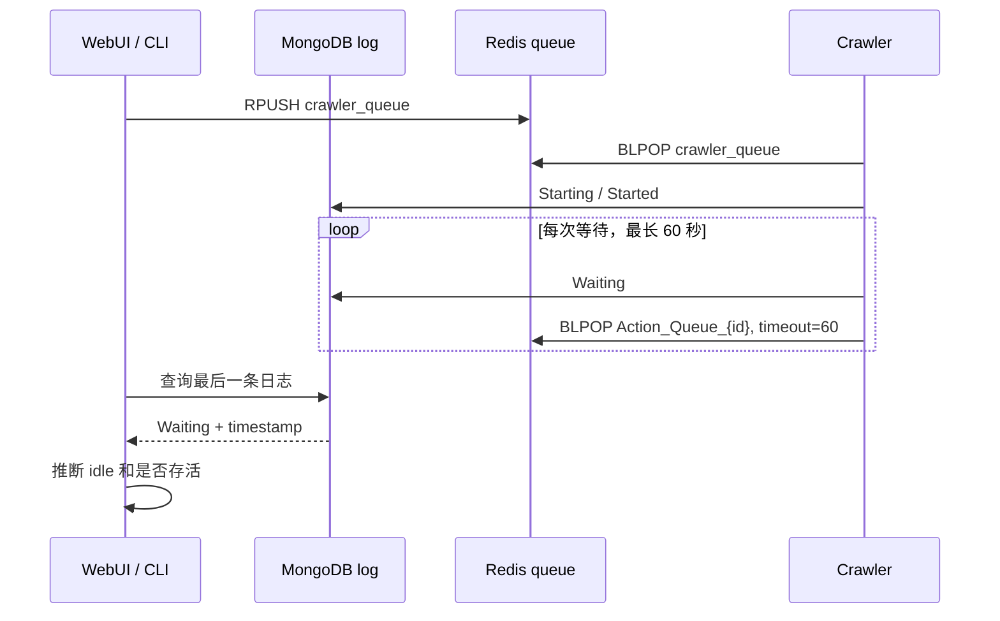
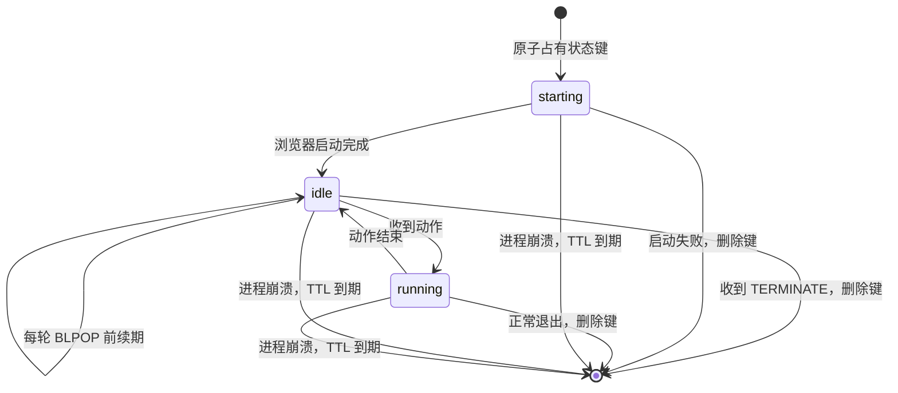
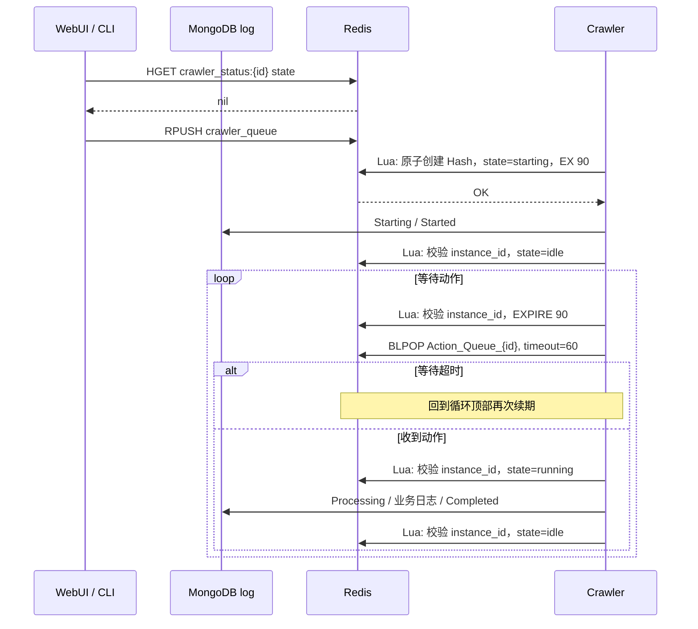

# Crawler 状态机制分析与 Redis 改造设计

## 1. 背景

当前系统把 MongoDB `log` 集合中的最后一条日志同时用作：

- 用户可查看的运行历史；
- crawler 是否存活的心跳；
- crawler 当前处于运行、空闲、停止还是异常状态的判断依据。

为了让等待中的 crawler 持续产生心跳，crawler 每次进入 `BLPOP` 前都会写入一条 `Waiting` 日志。`BLPOP` 最多阻塞 60 秒，超时后循环再次写入 `Waiting`。因此一个长期空闲的 crawler 会在 history 中不断积累没有业务价值的 `Waiting` 记录。

问题的根源不是 history 的展示方式，而是日志承担了实时状态存储的职责。日志应该记录离散事件，实时状态应该由独立的状态存储维护。

## 2. 当前实现

### 2.1 Crawler 的运行流程

`crawler/main.py` 中的 `Crawler.run()` 当前执行以下流程：

1. 查询该 crawler 的最后一条 MongoDB 日志。
2. 如果最后日志未超过 60 秒，且不是 `Terminated` 或 `Created`，认为已有实例运行，记录 `Error: Repeated` 后退出。
3. 加载 crawler 配置。
4. 写入 `Starting`。
5. 浏览器启动后写入 `Started`。
6. 每轮任务循环先写入 `Waiting`。
7. 对 `Action_Queue_{crawler_id}` 执行最长 60 秒的 `BLPOP`。
8. 等待超时后重新进入循环，再写一条 `Waiting`。
9. 收到动作后写入 `Processing`，执行完成后写入 `Completed`。
10. 收到 `TERMINATE` 后写入 `Terminated` 并退出。

这里的 `Waiting` 实际承担两种含义：

- 当前没有执行动作，即业务状态为“空闲”；
- 最近 60 秒内 crawler 仍然存活，即心跳。

### 2.2 WebUI 的状态推断

`webui/app.py` 的 `crawler_status()` 根据最后一条日志计算状态：

| 条件 | 返回状态 |
| --- | --- |
| 没有日志，或最后消息是 `Created` / `Terminated` | `stopped` |
| 最后日志超过 60 秒 | `error` |
| 最后消息是 `Idle` / `Waiting` | `idle` |
| 其他情况 | `running` |

该函数用于：

- crawler 列表状态展示；
- 编辑和删除前判断 crawler 是否正在运行；
- 启动时防止重复启动；
- 停止时判断 crawler 是否可停止。

前端只消费后端返回的 `running`、`idle`、`stopped`、`error`，不直接理解 `Waiting` 日志。因此迁移状态源时不需要修改前端状态展示协议。

### 2.3 CLI 的状态推断

`cli/cli.py` 的启动、停止和状态命令也查询 MongoDB 最后一条日志，并使用相似的 60 秒时间窗进行判断。

需要注意，当前 Compose 配置和 crawler/WebUI 使用数据库 `rainbow1`，而 CLI 代码使用数据库 `rainbow`。因此 CLI 当前属于一条可能已经过时或与 WebUI 不一致的管理链路。实施改造时仍应统一为 Redis 状态源，但数据库命名问题应单独确认，不能把它混入状态机制改造中。

### 2.4 当前时序



## 3. 当前方案的问题

### 3.1 History 被心跳污染

`Waiting` 不是有意义的业务事件，只是轮询产生的快照。空闲时间越长，无效日志越多，真正的启动、动作、异常和停止事件越难查看。

### 3.2 状态与事件耦合

最后一条日志是什么，未必等于当前状态。例如 crawler 在执行动作时写入一条 `Checkpoint`，WebUI 会将其推断为 `running`；动作完成后虽然写入 `Completed`，仍然会短暂显示 `running`，直到下一条 `Waiting` 出现。

### 3.3 心跳精度依赖日志写入

MongoDB 日志写入失败会让 crawler 被误判为异常，即使浏览器和 Redis 消费循环仍然正常。反过来，日志时间未过期也只能说明 crawler 最近写过日志，不能严格说明它此刻仍然存活。

### 3.4 重复启动检查存在竞态

当前 crawler 启动后才查询日志并判断是否重复。两个启动任务如果接近同时进入，可能都在对方写入 `Starting` 之前通过检查。日志查询和实例占有不是原子操作。

### 3.5 状态规则分散

相似的状态推断分别存在于 crawler、WebUI 和 CLI。消息名称或超时时间变化时，需要同步修改多处代码。

## 4. 目标设计

### 4.1 职责划分

- MongoDB `log`：只记录值得用户查看和排查的离散事件。
- Redis 状态键：保存 crawler 的实时状态和存活信息。
- Redis 队列：继续负责启动队列和动作队列。

改造后不再写入 `Waiting` 日志，也不再根据最后日志判断 crawler 状态。

### 4.2 Redis 键协议

每个 crawler 使用一个 Hash 键：

```text
crawler_status:{crawler_id}
```

Hash 包含以下字段：

```text
state       starting | idle | running
instance_id <启动时生成的 UUID>
updated_at  <Unix timestamp>
```

键设置 90 秒 TTL，由 crawler 在已有的流程点上顺带续期，不额外开协程：

```text
EXPIRE crawler_status:{crawler_id} 90
```

续期点：

| 续期点 | 频率保证 |
| --- | --- |
| 状态改变（`set_status`） | 每个动作前后各一次 |
| 取消检查点（`ensure_task_active`） | 每次等待、每个帖子循环 |
| 进入 `BLPOP` 前 | 空闲时最长 60 秒一次 |

选择 90 秒是为了覆盖瞬时调度延迟，同时让异常实例的状态及时消失。空闲时 `BLPOP` 最长阻塞 60 秒，超时后回到循环顶部再次续期，因此 90 秒 TTL 不会被空闲拖到过期。

浏览器启动阶段单独使用 300 秒 TTL：从原子占有状态键到 `set_status("idle")` 之间是一次长时间 `await`（`AsyncCamoufox` 启动、`new_page`、路由安装），中间没有续期点。所以取得所有权时写入 300 秒，进入 `idle` 后由 `set_status` 回落到 90 秒。代价是启动中崩溃的实例最长 5 分钟才显示为 `stopped`。

`stopped` 不需要作为持久值写入 Redis。正常停止时直接删除状态键。这样 Redis 中“没有键”表示当前没有活跃实例，也避免停止状态永久残留。

### 4.3 对外状态映射

WebUI 继续返回现有四种状态，避免修改前端协议：

| Redis 状态 | API 状态 | 含义 |
| --- | --- | --- |
| `starting` | `running` | 实例已占有，浏览器正在启动 |
| `running` | `running` | 正在执行动作 |
| `idle` | `idle` | 浏览器已启动，正在等待动作 |
| 状态键不存在 | `stopped` | 没有活跃实例，或实例续期已过期 |

在新模型中，仅凭状态键过期无法区分“主动停止”和“进程异常退出”。建议第一阶段都映射为 `stopped`，因为 Redis 中不存在可靠信息证明退出原因。MongoDB 最后的 `Error` 日志仍可用于排障，但不再参与实时状态判断。

如果产品确实需要 `error` 状态，应在后续增加一个独立、短期保留的退出结果键，或由进程监管器上报异常；不应重新依赖最后日志推断。当前前端可暂时保留 `error` 样式，但第一阶段不会由状态查询产生该值。

### 4.4 状态生命周期



### 4.5 重复启动保护

启动实例时使用 Lua 脚本原子检查键并创建 Hash：

```text
如果键不存在：HSET state starting、instance_id、updated_at，然后设置 90 秒 TTL
```

- 返回成功：当前实例取得运行权，继续启动。
- 返回失败：已有未过期状态键，当前实例记录 `Error: Repeated` 后退出。

这比“读取最后日志，再决定是否启动”更可靠，因为检查和写入在 Redis 中是一个原子操作。

WebUI/CLI 的 launch 接口也应先读取状态键，若存在则拒绝重复入队。这里主要改善用户反馈；真正防止竞态的最终保障仍是 crawler 进程中的原子 Lua 脚本。

## 5. 改造后的运行流程

### 5.1 Crawler

`Crawler.run()` 应调整为：

1. 使用 Lua 脚本原子创建状态 Hash 并取得所有权。
2. 若取得失败，记录一次 `Error: Repeated` 并退出。
3. 加载配置；不存在时删除状态键并记录错误。
4. 写入 `Starting` 日志。
5. 浏览器启动完成后写入 `Started` 日志，并将状态设为 `idle`。
6. 对动作队列执行最长 60 秒的 `BLPOP`。
7. 进入 `BLPOP` 前、状态改变时以及每个取消检查点，都通过 Lua 校验 `instance_id` 并刷新 TTL，不写日志。
8. 收到普通动作后将状态设为 `running`，记录 `Processing`，执行动作。
9. 动作结束后记录 `Completed`，将状态设为 `idle`。
10. 收到 `TERMINATE` 后记录 `Terminated`，删除状态键并退出。
11. 无论正常返回还是未处理异常，都在 `finally` 中删除本实例持有的状态键。

第 11 步通过 Lua 校验 `instance_id`：只有当前状态键的持有者可以更新、续期或删除，旧实例不能覆盖或删除新实例状态。

### 5.2 状态键所有权

为避免状态更新和清理的所有权竞态，推荐使用 Redis Hash，而不是只有状态字符串：

```text
Key: crawler_status:{crawler_id}
Type: Hash

state       idle
instance_id <启动时生成的 UUID>
updated_at  <Unix timestamp>
```

创建时通过 Lua 脚本完成 `EXISTS` 检查、`HSET` 和 `EXPIRE`。刷新和删除时也通过 Lua 校验 `instance_id`，只有当前实例能够修改自己的状态键。

该所有权检查已经纳入实现，以覆盖旧实例延迟退出、新实例接管后的竞态。

### 5.3 WebUI

WebUI 应新增统一的 Redis 状态读取函数，例如：

```python
async def crawler_status(redis_client, crawler_id: str) -> str:
    state = await redis_client.hget(f"crawler_status:{crawler_id}", "state")
    if state == "idle":
        return "idle"
    if state in {"starting", "running"}:
        return "running"
    return "stopped"
```

然后替换列表、编辑、删除、启动和停止接口中对最后日志的查询与判断。

删除 crawler 时额外删除 `crawler_status:{crawler_id}`。日志接口保持不变，只是以后不会继续产生 `Waiting`。

### 5.4 CLI

CLI 的 `launch`、`terminate` 和 `status` 命令改为读取同一个 Redis 状态键，不再查询 MongoDB 最后一条日志。同步 Redis 客户端的 `decode_responses=True`，避免状态值以 `bytes` 返回。

CLI 数据库名不一致的问题不属于本设计的状态改造范围，但实施前应确认 CLI 是否仍在使用，并决定是否统一为 `rainbow1`。

## 6. 改造后时序



## 7. 日志保留规则

改造后建议保留以下日志：

- `Created`
- `Starting`
- `Started`
- `Processing`
- `Action`
- `Checkpoint`
- `Screenshot`
- `Completed`
- `Warning`
- `Error`
- `Terminated`

删除 crawler 运行循环中的 `Waiting` 日志。已有的历史 `Waiting` 数据不需要迁移或兼容处理；如果希望立即清爽，可以单次删除：

```javascript
db.log.deleteMany({ message: "Waiting" })
```

是否清理旧数据应在代码改造完成后手动决定，不应放进应用启动逻辑。

## 8. 实施范围

第一阶段最小改动涉及：

1. `crawler/main.py`
   - 增加状态键辅助方法或常量；
   - 用 Redis 原子键替换基于最后日志的重复实例检查；
   - 删除 `Waiting` 日志；
   - 在等待、执行动作和退出时维护状态键及 TTL。
2. `webui/app.py`
   - 将 `crawler_status(last_log)` 改为异步读取 Redis；
   - 所有管理接口改用 Redis 状态；
   - 删除 crawler 时清理状态键。
3. `cli/cli.py`
   - 启动、停止和状态命令改读 Redis；
   - Redis 客户端开启字符串解码。
4. `README.md`
   - 将 Redis 的职责从“任务队列 / 心跳”明确为“任务队列 / 实时状态”。

前端文件不需要修改。

## 9. 验证标准

实施后至少验证以下行为：

1. 启动 crawler 后，Redis 存在 `crawler_status:{id}` Hash，其 `state` 先为 `starting`，随后为 `idle`。
2. crawler 空闲超过两个 `BLPOP` 周期后，状态键仍存在且 TTL 被刷新。
3. 空闲期间 MongoDB history 不再新增 `Waiting`。
4. 执行动作时状态为 `running`，动作完成后恢复为 `idle`。
5. 正常停止后状态键被删除，API 返回 `stopped`。
6. 强制终止 crawler 进程后，状态键在 TTL 到期后消失，API 返回 `stopped`。
7. 同一个 crawler 被重复启动时，只有一个实例能通过原子占有脚本。
8. WebUI 的编辑、删除、启动和停止限制与状态键一致。
9. CLI 与 WebUI 对同一个 crawler 显示相同状态。

## 10. 结论

当前 `Waiting` 日志堆积是“用事件日志模拟实时状态”的直接结果。改造的核心不是隐藏 `Waiting`，而是把实时状态从 MongoDB 日志中拆出，交给带 TTL 的 Redis 状态键维护。

实现采用 `crawler_status:{crawler_id}` Hash、实例 UUID、`starting/idle/running` 三种内部状态、按流程点续期和 90 秒 TTL，可以实现：

- history 不再产生重复 `Waiting`；
- 状态查询不再依赖最后日志；
- crawler 异常退出后状态自动过期；
- 重复实例通过 Redis 原子操作得到更可靠的保护；
- WebUI 前端状态协议保持不变。