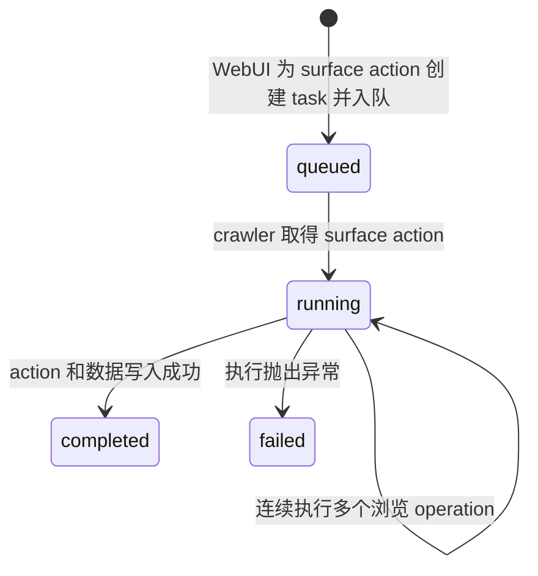
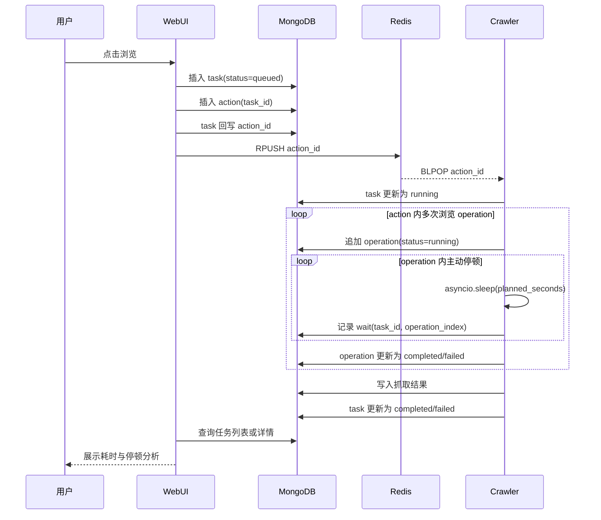

# 任务分析设计

## 1. 背景与目标

当前 WebUI 中的“浏览”会创建一条 `surface` action，并通过 Redis 队列交给 crawler 执行。crawler 会记录通用日志，但无法回答以下问题：

- 某次浏览何时入队、何时开始、何时结束；
- 任务在队列中等待了多久；
- 任务执行总共花了多久；
- 执行期间主动停顿了多少次、每次停顿多久；
- 时间主要消耗在主动停顿还是页面操作、网络加载和数据处理；
- 不同 crawler、不同任务之间的耗时是否出现明显变化。

本设计新增一个名为“任务分析”的页面。数据边界严格定义为：

- 一条 action 对应一条 task；
- 用户点击一次“浏览”只创建一条 `surface` action，因此也只创建一条 task；
- 一条 `surface` action 内部会连续处理多个帖子，每次帖子处理是一条浏览 operation；
- operation 是 task 的执行明细，不是新的 task。

第一阶段只为 `surface` action 建立 task，不改变“跳转”“滚动”“截屏”等其他 action 的含义。后续若要分析其他 action，仍沿用“一条 action 对应一条 task”的规则。

## 2. MongoDB 建模决策

### 2.1 使用固定 collection，不为每个任务新建 collection

MongoDB 中与关系数据库“表”对应的概念是 collection。项目现有 `crawler/db.py` 已经声明了 `task` collection，但尚未使用。

本设计使用一个固定的 `task` collection，每条需要分析的 action 在其中新增一条 document：

```text
rainbow1.task
  ├── surface action A 对应的 task document
  │     ├── operation 0
  │     ├── operation 1
  │     └── operation 2
  └── surface action B 对应的 task document
```

不采用“一条 action 新建一个 collection”，原因是：

- 任务列表和跨任务统计需要枚举大量 collection；
- 每个 collection 都要单独管理索引；
- collection 数量会随浏览次数持续增长；
- 分页、筛选、聚合和清理都会明显复杂化；
- 单条 task document 已经能够表达一条 action、内部多次 operation 及其停顿明细。

因此，本文后续所说的“新建任务”均指为一条 action 向 `task` collection 插入一条 document，而不是为 action 内的每次浏览 operation 插入 task。

### 2.2 任务 document

建议结构如下：

```javascript
{
  _id: ObjectId("..."),
  crawler_id: "xhs_TEL7236",
  action_id: ObjectId("..."),
  type: "surface",
  status: "completed",

  enqueued_at: 1789956000.120,
  started_at: 1789956002.410,
  finished_at: 1789956128.930,

  queue_seconds: 2.290,
  execution_seconds: 126.520,
  wait_seconds: 74.310,
  active_seconds: 52.210,
  total_seconds: 128.810,

  wait_count: 17,
  waits: [
    {
      stage: "initial",
      operation_index: null,
      started_at: 1789956002.520,
      planned_seconds: 6.231,
      actual_seconds: 6.238
    },
    {
      stage: "post",
      operation_index: 0,
      started_at: 1789956009.030,
      planned_seconds: 2.814,
      actual_seconds: 2.819
    }
  ],

  operation_count: 12,
  operations: [
    {
      index: 0,
      post_index: 0,
      post_id: "67f...",
      status: "completed",
      started_at: 1789956008.910,
      finished_at: 1789956018.420,
      elapsed_seconds: 9.510,
      wait_seconds: 6.720,
      active_seconds: 2.790,
      error: null
    }
  ],

  result: {
    grabbed_count: 12,
    inserted_count: 12
  },
  error: null
}
```

字段说明：

| 字段 | 含义 |
| --- | --- |
| `crawler_id` | 执行任务的 crawler |
| `action_id` | 对应的 `action` document，用于关联现有队列动作 |
| `type` | 第一阶段固定为 `surface` |
| `status` | `queued`、`running`、`completed` 或 `failed` |
| `enqueued_at` | 用户点击“浏览”并创建任务的时间 |
| `started_at` | crawler 开始执行该 action 的时间 |
| `finished_at` | 成功或失败结束的时间 |
| `queue_seconds` | 从入队到开始执行的时长 |
| `execution_seconds` | crawler 实际执行任务的总时长 |
| `wait_seconds` | 所有主动停顿实际时长之和 |
| `active_seconds` | 执行时长减去主动停顿时长 |
| `total_seconds` | 从入队到结束的总时长 |
| `wait_count` | 主动停顿次数 |
| `waits` | action 内每次主动停顿的阶段、所属 operation、计划时长和实际时长 |
| `operation_count` | 该 action 内已开始的浏览 operation 数量 |
| `operations` | 每次帖子浏览操作的状态、耗时、停顿和结果 |
| `result` | 抓取数、写入数等任务结果 |
| `error` | 失败摘要；成功时为 `null` |

`operations` 和 `waits` 都采用内嵌数组，因为当前一条 `surface` action 受 `surface_max_posts` 限制，操作和停顿数量有明确上界，并且页面查看任务详情时通常需要整组读取。若未来取消任务规模上限，再考虑拆分到独立 collection；第一阶段不提前增加这层复杂度。

### 2.3 三层数据关系

```text
task（1 条 action）
  ├── operation（第 1 次帖子浏览）
  │     ├── post 等待
  │     ├── detail_open 等待
  │     └── detail_close 或 error_recovery 等待
  ├── operation（第 2 次帖子浏览）
  │     └── ...
  └── task 级等待
        ├── initial 等待
        └── 尚未进入具体 operation 时的 scroll 等待
```

operation 的边界以 `grab()` 中一次帖子处理循环为准，从选定一个待处理帖子开始，到成功关闭详情或异常恢复结束。循环中尚未取得具体帖子的滚动加载不单独创建 operation，其等待记录在 task 上，并令 `operation_index=null`。

### 2.4 索引

第一阶段建议建立以下索引：

```javascript
db.task.createIndex({ enqueued_at: -1 })
db.task.createIndex({ crawler_id: 1, enqueued_at: -1 })
db.task.createIndex({ status: 1, enqueued_at: -1 })
db.task.createIndex({ action_id: 1 }, { unique: true })
```

索引用于支持任务倒序分页、crawler 筛选、状态筛选和 action 关联。索引可以在部署时手动建立，第一阶段不需要引入迁移框架。

## 3. 时间口径

### 3.1 五类时间

设：

- 入队时间为 $t_q$；
- 开始执行时间为 $t_s$；
- 结束时间为 $t_f$；
- 第 $i$ 次主动停顿的实际时长为 $w_i$。

则：

$$
T_{queue}=t_s-t_q
$$

$$
T_{execution}=t_f-t_s
$$

$$
T_{wait}=\sum_{i=1}^{n}w_i
$$

$$
T_{active}=\max(0,T_{execution}-T_{wait})
$$

$$
T_{total}=t_f-t_q=T_{queue}+T_{execution}
$$

其中 `active_seconds` 是“非主动停顿时间”，包含 Playwright 操作、页面网络加载、DOM 等待、截图、MongoDB 请求以及 Python 代码执行时间。它不是纯 CPU 时间。

### 3.2 计划停顿与实际停顿

现有 `wait()` 会先计算随机 delay，再调用 `asyncio.sleep()`。任务分析同时记录：

- `planned_seconds`：传给 `asyncio.sleep()` 的目标时长；
- `actual_seconds`：从 sleep 前到 sleep 返回后的单调时钟差值。

事件循环调度可能让实际停顿略长于计划值，因此统计汇总使用 `actual_seconds`，计划值只用于分析配置与实际执行的偏差。

持续时长应使用 `time.monotonic()` 测量，避免系统时间调整导致负数或跳变；写入 MongoDB 的 `*_at` 时间戳仍使用 `time.time()`，供页面展示真实日期时间。MongoDB 中只保存计算后的持续时长，不保存单调时钟值。

### 3.3 停顿阶段命名

将现有 multiplier key 映射为稳定的阶段名：

| multiplier key | `stage` |
| --- | --- |
| `wait_initial_multiplier` | `initial` |
| `wait_scroll_multiplier` | `scroll` |
| `wait_post_multiplier` | `post` |
| `wait_detail_open_multiplier` | `detail_open` |
| `wait_detail_close_multiplier` | `detail_close` |
| `wait_error_multiplier` | `error_recovery` |

任务页面使用中文标签展示，但数据库保存稳定的英文枚举值。

## 4. 任务生命周期



### 4.1 入队

用户点击一次“浏览”时，WebUI 创建一条 `surface` action 和一条 task，按以下顺序执行：

1. 向 `task` 插入 `status=queued` 的任务 document；
2. 向 `action` 插入 `action=surface`，并写入 `task_id`；
3. 将生成的 `action_id` 回写到任务；
4. 将 `action_id` 推入 Redis action 队列；
5. API 返回 `task_id` 和 `action_id`。

这样可以从用户点击时开始计算排队时间。其他 action 继续沿用现有 `enqueue_action()`，不创建任务。

若 MongoDB 写入成功但 Redis 入队失败，应把任务更新为 `failed` 并记录 `error`，避免页面永久显示 `queued`。当前部署没有配置 MongoDB 事务，因此第一阶段用明确的失败状态收敛，不引入跨 MongoDB 与 Redis 的伪事务。

### 4.2 开始执行

crawler 从 Redis 取出 action 并确认它是 `surface` 后：

1. 读取 action 中的 `task_id`；
2. 把任务更新为 `running`；
3. 写入 `started_at`；
4. 计算并写入 `queue_seconds`；
5. 将当前 `task_id` 保存在 crawler 实例内，供 `wait()` 记录停顿。

### 4.3 记录停顿

每次 `wait()` 完成后，使用一次 MongoDB `$push` + `$inc` 更新：

```javascript
{
  $push: {
    waits: {
      stage: "post",
      started_at: 1789956009.030,
      planned_seconds: 2.814,
      actual_seconds: 2.819
    }
  },
  $inc: {
    wait_count: 1,
    wait_seconds: 2.819
  }
}
```

只有执行已关联 task 的 action 时设置当前 `task_id`。其他 action 即使未来复用 `wait()`，也不会错误写入上一个 task。

### 4.4 记录浏览 operation

`surface` task 进入 `grab()` 后会连续执行多个帖子浏览 operation。每次开始处理一个帖子时：

1. 生成递增的 `operation_index`；
2. 向 `operations` 追加一条 `status=running` 的记录；
3. 设置当前 operation 上下文，使后续 `post`、`detail_open`、`detail_close` 或 `error_recovery` 等等待记录带上该 `operation_index`；
4. 成功关闭详情后，把该 operation 更新为 `completed`；
5. 捕获该帖子处理异常并完成恢复后，把该 operation 更新为 `failed`，但 task 继续执行后续 operation；
6. 在 `finally` 中清空当前 operation 上下文。

任务级 `failed` 与 operation 级 `failed` 含义不同：单个帖子失败只影响该 operation；只有异常中止整条 action 时，task 才标记为 `failed`。

operation 的耗时字段按与 task 相同的原则计算：

$$
T_{operation}=T_{operation\_wait}+T_{operation\_active}
$$

其中 `operation_wait` 只累计 `operation_index` 指向该 operation 的等待。`initial` 和滚动加载等 task 级等待不分摊到任何 operation。

### 4.5 成功结束

`surface()` 返回抓取结果并完成 `rawdata` 写入后，把任务更新为 `completed`，同时写入：

- `finished_at`；
- `execution_seconds`；
- `active_seconds`；
- `total_seconds`；
- `result.grabbed_count`；
- `result.inserted_count`。

任务完成统计必须覆盖数据写入时间，因此结束点放在 `insert_many()` 之后。

### 4.6 失败结束

现有 `run()` 会捕获 `work()` 的异常并继续处理下一条 action。这里应在同一个异常分支把当前任务更新为 `failed`，保存结束时间、各耗时字段和错误摘要。

无论成功或失败，都在 `finally` 中清空 crawler 实例上的当前任务上下文，防止后续 action 继续向旧任务写入停顿。

进程被强制终止时无法执行 `finally`，对应任务会停留在 `running`。第一阶段页面把这类任务如实显示为“运行中”；后续如有需要，可以根据 crawler 状态键消失且任务长时间未更新来增加“中断”状态。本文不把基于超时的推断混入第一阶段。

## 5. 数据流



## 6. “任务分析”页面

### 6.1 页面入口

在顶部品牌区域之后增加一级导航：

- `爬虫实例`：现有主页面；
- `任务分析`：新页面。

第一阶段可以继续使用同一个 `index.html`，通过两个顶层 view 切换，不引入前端路由框架。浏览器地址可使用 hash，例如 `#/tasks`，刷新后仍能回到任务分析页面。

### 6.2 页面布局

任务分析页采用列表加详情的工作台布局：

1. 顶部汇总
   - 任务总数；
   - 成功率；
   - 平均总耗时；
   - 平均主动停顿占比。
2. 筛选栏
   - crawler；
   - 状态；
   - 时间范围；
   - 刷新按钮。
3. 任务列表
   - 入队时间；
   - crawler；
   - 状态；
   - 排队时长；
   - 执行时长；
   - 停顿时长与次数；
   - 非停顿时长；
   - 抓取数量。
4. 任务详情
   - 任务基础信息和错误摘要；
   - 排队、停顿、非停顿的时间构成条；
   - 按阶段聚合的停顿次数与时长；
  - 该 action 内的浏览 operation 列表及每次操作耗时；
   - 每次停顿明细表。

列表默认按 `enqueued_at` 倒序，每页 50 条。点击某条任务后打开详情；不在列表响应中返回完整 `waits` 数组，避免轮询时重复传输大量明细。

### 6.3 指标解释

页面应明确区分：

- **排队**：任务等待 crawler 消费的时间；
- **主动停顿**：代码显式调用等待模型产生的时间；
- **非停顿**：执行时长中除主动停顿外的所有时间；
- **总耗时**：排队加执行。

停顿占比按下式计算：

$$
R_{wait}=\begin{cases}
T_{wait}/T_{execution}, & T_{execution}>0 \\
0, & T_{execution}=0
\end{cases}
$$

该比例只用于分析一次任务内部时间构成，不应把排队时间放入分母。

## 7. API 设计

### 7.1 任务列表

```http
GET /api/tasks?crawler_id=xhs_TEL7236&status=completed&limit=50&before=<timestamp>
```

返回任务摘要，不包含 `waits`：

```json
{
  "items": [],
  "next_before": 1789956000.120
}
```

使用 `before` 游标分页，避免任务增多后使用大 offset。

### 7.2 任务详情

```http
GET /api/tasks/{task_id}
```

返回完整任务 document，包括 `waits`。

### 7.3 汇总统计

```http
GET /api/tasks/summary?crawler_id=xhs_TEL7236&from=<timestamp>&to=<timestamp>
```

返回：

```json
{
  "task_count": 120,
  "completed_count": 116,
  "failed_count": 4,
  "success_rate": 0.9667,
  "average_queue_seconds": 1.82,
  "average_execution_seconds": 131.40,
  "average_wait_seconds": 76.15,
  "average_active_seconds": 55.25,
  "wait_ratio": 0.5795
}
```

汇总只对已有对应数值的任务计算平均值；`queued` 和 `running` 不进入完成耗时平均值。

## 8. 代码改动范围

### 8.1 `webui/app.py`

- “浏览”入队时创建 task document；
- action 增加 `task_id`；
- 返回 `task_id`；
- 新增任务列表、详情和汇总 API；
- 删除 crawler 时同步删除它的任务。

### 8.2 `crawler/main.py`

- 增加当前任务上下文；
- `surface` 开始时把任务置为 `running`；
- `grab()` 的帖子处理循环创建并完成多条 operation；
- `wait()` 记录计划和实际停顿，并关联当前 operation；
- `surface` 结束时写入成功结果；
- `work()` 异常时写入失败结果；
- 成功或失败后清空任务上下文。

### 8.3 WebUI 静态文件

- 增加一级导航和任务分析 view；
- 增加任务列表、筛选、汇总和详情；
- 复用现有自动刷新节奏，但列表响应不携带停顿明细；
- 任务详情打开时单独请求完整数据。

## 9. 边界与非目标

第一阶段明确不包含：

- 为历史 `surface` action 补建任务；
- 把跳转、滚动、截屏建模为任务；
- 统计 CPU 使用率、浏览器网络瀑布或单个 Playwright 调用耗时；
- 为强制终止的进程自动推断失败原因；
- 为旧数据增加兼容分支；
- 为每个任务创建独立 MongoDB collection。

已有数据无需迁移。上线后产生的新“浏览”操作才会进入任务分析。

## 10. 验证标准

实现后至少验证以下行为：

1. 每点击一次“浏览”，只创建一条 `surface` action，`task` collection 也恰好新增一条 `queued` document。
2. 对应 action 同时保存正确的 `task_id`，任务保存正确的 `action_id`。
3. crawler 开始执行后，任务变为 `running`，并产生正确的排队时长。
4. 一条 action 处理 $N$ 个帖子时，仍只有一条 task，并在其中产生 $N$ 条已开始的 operation 记录。
5. 每次 `wait()` 都新增一条等待明细，`wait_count` 和 `wait_seconds` 与明细一致。
6. operation 内的等待带有正确的 `operation_index`；task 级等待的 `operation_index` 为 `null`。
7. 单个 operation 失败不会直接把整个 task 标记为 `failed`，后续 operation 仍可继续执行。
8. 成功任务变为 `completed`，整条 action 异常中止时任务变为 `failed`，两者都有结束时间和耗时汇总。
9. `execution_seconds` 近似等于 `wait_seconds + active_seconds`，允许浮点舍入误差。
10. `total_seconds` 近似等于 `queue_seconds + execution_seconds`。
11. 其他 action 不创建任务，也不会向最近一条 `surface` task 写入 operation 或等待。
12. 任务列表可以按 crawler 和状态筛选，并稳定倒序分页。
13. 任务详情中的 operation、阶段汇总与等待明细计算结果一致。

## 11. 实施顺序

建议按以下顺序实现：

1. 建立 task 索引并实现浏览入队建档；
2. 在 crawler 中接入任务生命周期和停顿记录；
3. 增加任务查询与汇总 API；
4. 增加“任务分析”页面；
5. 用一次成功浏览和一次主动制造的失败浏览校验全部时间口径。

这样可以先确保数据正确，再开始页面展示，避免前端依赖尚未稳定的字段。