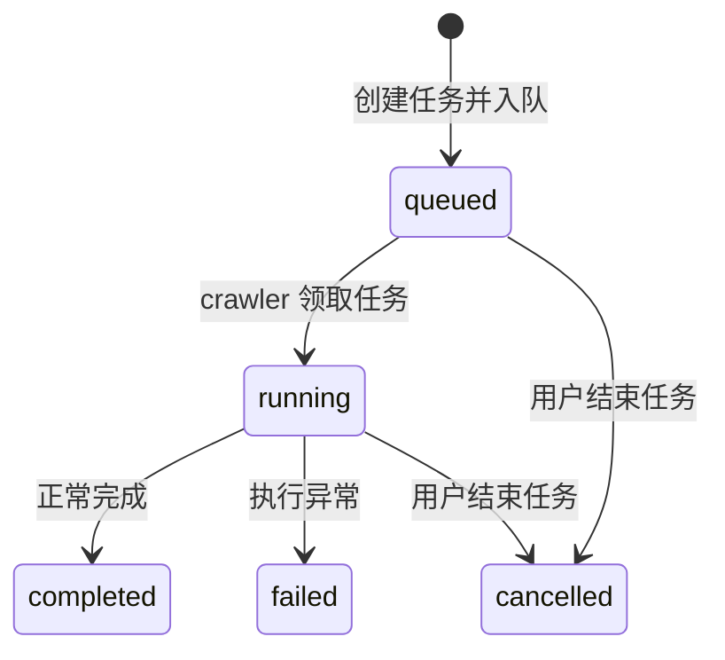
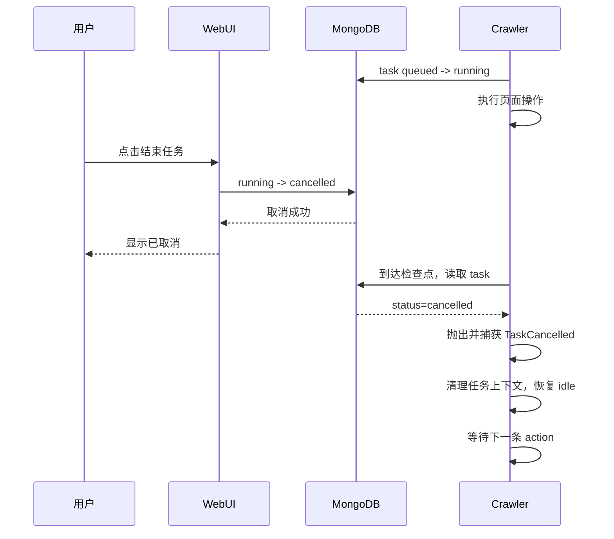

# 任务人工取消机制设计

## 1. 背景

`surface` 任务可能执行较长时间。执行期间如果 crawler 进程异常退出，任务会永久停留在 `running`；如果页面操作卡住，当前也没有办法从 WebUI 中结束任务。

本项目只有单个使用者，任务异常能够被及时发现，因此不引入任务租约、任务心跳、自动过期扫描或自动恢复机制。所有遗留任务都由用户在 WebUI 中手工结束。

本设计需要覆盖以下场景：

- crawler 尚未领取任务，用户取消排队中的任务；
- crawler 正在执行任务，用户要求停止当前任务；
- crawler 已异常退出，用户把遗留的 `running` 任务标记为已取消；
- crawler 在用户取消后从阻塞操作中恢复，不能继续处理或覆盖取消结果；
- crawler 放弃被取消的任务后继续等待下一条 action，不退出实例。

## 2. 设计原则

### 2.1 只使用人工取消

系统不根据运行时长、crawler 在线状态或最后更新时间自动结束任务，也不增加后台清理协程。

任务是否应当结束由用户判断。用户点击“结束任务”后，任务立即在 MongoDB 中进入 `cancelled` 终态；仍然存活的 crawler 在后续检查点发现取消状态后停止处理该任务。

取消排队中的任务时只更新 MongoDB，不修改 Redis action 队列。该 action 保持原有队列位置，轮到它并被 crawler 取出后，crawler 查询对应 task；若状态为 `cancelled`，便跳过该 action 并继续等待下一条。

### 2.2 取消是协作式的

取消操作不直接终止 crawler 进程，也不强制取消 crawler 的 asyncio task。

crawler 可能正阻塞在 Playwright、MongoDB 或其他异步调用中。此时取消状态会先写入 MongoDB，crawler 等当前调用返回后，在下一个取消检查点停止任务。

因此，“结束任务”表示任务已经被用户宣告结束，不保证当前浏览器操作在点击按钮后瞬间停止。可能长时间阻塞的外部调用应设置明确的 timeout，保证 crawler 最终能够抵达取消检查点。

### 2.3 取消是不可逆终态

任务一旦进入 `cancelled`，crawler 后续的正常完成或异常处理都不能把它改回 `completed` 或 `failed`。

所有任务终结更新都必须带当前状态条件，通过 MongoDB 原子更新决定最终结果。

## 3. 任务状态

任务状态扩展为：

| 状态 | 含义 | 是否终态 |
| --- | --- | --- |
| `queued` | 已入队，等待 crawler 领取 | 否 |
| `running` | crawler 正在执行 | 否 |
| `completed` | 正常完成 | 是 |
| `failed` | 执行过程中捕获到异常 | 是 |
| `cancelled` | 用户手工结束 | 是 |

状态转换如下：



不增加 `expired`、`cancelling` 等中间状态。

## 4. 数据结构

任务取消后增加以下字段：

```javascript
{
  status: "cancelled",
  cancelled_at: 1789956128.930,
  finished_at: 1789956128.930
}
```

字段说明：

| 字段 | 含义 |
| --- | --- |
| `status` | 固定为 `cancelled` |
| `cancelled_at` | 用户执行取消操作的时间 |
| `finished_at` | 任务生命周期结束时间，与 `cancelled_at` 相同 |

第一阶段不增加取消原因输入。项目目前只有人工取消这一种来源，`status=cancelled` 已经能够完整表达原因。

任务取消时保留已有的 `waits`、`operations`、计数和耗时数据，不执行回滚。已经写入 `rawdata` 的数据同样保留。

## 5. 取消 API

新增接口：

```http
POST /api/tasks/{task_id}/cancel
```

接口使用带状态条件的原子更新：

```javascript
db.task.updateOne(
  {
    _id: taskId,
    status: { $in: ["queued", "running"] }
  },
  {
    $set: {
      status: "cancelled",
      cancelled_at: now,
      finished_at: now
    }
  }
)
```

接口行为：

| 条件 | 结果 |
| --- | --- |
| 任务不存在 | 返回 `404` |
| 状态为 `queued` 或 `running` | 更新为 `cancelled` 并返回成功 |
| 状态为 `completed`、`failed` 或 `cancelled` | 返回 `409`，不修改任务 |

取消 `queued` 任务时，不从 Redis action 队列中删除对应 action，也不改变它在队列中的位置。取消接口只把 MongoDB task 更新为 `cancelled`。该 action 正常排到队首并被 crawler 取出后，crawler 读取 task 状态，发现已经取消便直接跳过。这样不需要维护 MongoDB 与 Redis 之间的跨存储一致性。

## 6. Crawler 取消机制

### 6.1 内部取消异常

crawler 使用一个只在内部传播的异常退出当前任务：

```python
class TaskCancelled(Exception):
    pass
```

统一检查方法读取当前任务状态：

```python
async def ensure_task_active(self):
    if self.current_task_id is None:
        return

    task = await DB.task_db.find_one(
        {"_id": self.current_task_id},
        {"status": 1},
    )
    if task and task["status"] == "cancelled":
        raise TaskCancelled()
```

`TaskCancelled` 只用于结束当前 action，不作为 crawler 错误，也不把任务更新为 `failed`。

### 6.2 取消检查点

为控制 MongoDB 查询次数，不在每个语句前检查。第一阶段在以下边界检查：

1. crawler 从 Redis 取出 action 并读取 task 后、调用 `start_task()` 前；
2. `start_task()` 完成后、进入 `work()` 前；
3. `grab()` 每轮帖子处理开始时；
4. 每次 `wait()` 返回后；
5. `surface()` 准备向 `rawdata` 写入结果前；
6. `finish_task()` 更新任务终态时。

这些检查点覆盖排队任务跳过、长任务循环退出、主动等待后的及时退出和最终数据写入拦截。

Playwright 调用无法被 MongoDB 状态检查打断。对可能长时间等待的调用继续使用明确 timeout；调用结束或超时后，crawler 在下一个检查点响应取消。

### 6.3 排队任务被取消

取消按钮不会操作 Redis。被取消任务对应的 action 仍然留在原队列位置，直到 crawler 按正常顺序消费它。

crawler 从 Redis 取得 action 后：

1. 读取 action；
2. 如果 action 有 `task_id`，读取对应 task；
3. 如果 task 状态是 `cancelled`，不调用 `start_task()`，直接继续等待下一条 action；
4. 其他 action 保持现有行为。

被取消 action 留在 Redis 队列中不会造成重复执行，因为 Redis `BLPOP` 已经将其移出队列，crawler 只需要跳过本次处理。

### 6.4 执行中任务被取消

crawler 捕获 `TaskCancelled` 后执行以下操作：

- 不调用 `finish_task("failed")`；
- 不再写入该任务的新 `waits`、`operations` 或 `rawdata`；
- 清空 `current_task_id`、`current_operation_index` 和单调时钟上下文；
- 将 crawler 实时状态恢复为 `idle`；
- 继续 action 消费循环。

取消时如果当前 operation 仍是 `running`，保留该状态，用于展示任务停止时所在的位置。不额外把 operation 改成 `cancelled`，避免扩大 operation 状态模型。

## 7. 并发与终态保护

### 7.1 开始任务

`start_task()` 只能把仍处于 `queued` 的任务更新为 `running`：

```javascript
{
  _id: taskId,
  status: "queued"
}
```

如果更新数量为零，crawler 重新读取状态：

- `cancelled`：抛出 `TaskCancelled` 并跳过；
- 其他状态：不执行该 action，避免重复处理。

这样可以处理用户取消与 crawler 领取任务同时发生的竞态。

### 7.2 正常完成或失败

`finish_task()` 只能更新仍处于 `running` 的任务：

```javascript
{
  _id: taskId,
  status: "running"
}
```

适用于 `completed` 和 `failed` 两种更新。若用户已经将任务改成 `cancelled`，更新数量为零，crawler 不再覆盖终态。

### 7.3 写入任务明细

`wait()`、`start_operation()` 和 `finish_operation()` 对任务的更新也应附带：

```javascript
{
  _id: taskId,
  status: "running"
}
```

这样即使取消发生在检查点之后、MongoDB 更新之前，也不会继续向已经取消的任务追加明细。

## 8. WebUI 改造

### 8.1 状态展示

前端任务状态增加：

```javascript
cancelled: "已取消"
```

任务筛选增加“已取消”选项，并为该状态提供独立样式。

### 8.2 结束任务按钮

任务详情中，当状态为 `queued` 或 `running` 时显示“结束任务”按钮。

交互流程：

1. 用户点击“结束任务”；
2. 弹出确认提示；
3. 调用取消 API；
4. 成功后关闭或刷新详情；
5. 重新加载任务列表和汇总数据。

其他终态不显示该按钮。

### 8.3 汇总统计

现有成功率继续只使用 `completed` 和 `failed` 作为已执行结果。`cancelled` 不计入成功率分母，也不计入平均执行、平均停顿和平均活跃时间。

任务总数包含 `cancelled`，使列表数量与汇总数量一致。

## 9. 处理时序



如果 crawler 已经退出，则时序止于 WebUI 将任务更新为 `cancelled`，不需要额外清理动作。

## 10. 不在本次范围内

本次不实现以下能力：

- 自动过期或后台扫描；
- task 心跳或租约；
- 取消后自动重试；
- 强制终止 crawler 进程；
- 回滚已经写入的 `rawdata`；
- 从 Redis 队列中主动删除 action；
- operation 级单独取消；
- 取消原因输入和审计记录。

## 11. 实施顺序

1. 后端任务状态查询支持 `cancelled`；
2. 增加任务取消 API；
3. crawler 增加 `TaskCancelled` 和统一检查方法；
4. `start_task()`、`finish_task()` 和任务明细更新增加状态条件；
5. 在任务循环、等待结束和数据写入前增加取消检查点；
6. crawler 捕获取消并恢复到 action 等待循环；
7. WebUI 增加取消状态、筛选项和结束按钮；
8. 验证排队取消、执行中取消和遗留任务人工收尾三种路径。

## 12. 验收标准

- `queued` 任务可以由用户标记为 `cancelled`，crawler 后续不会执行对应 action；
- `running` 任务可以由用户标记为 `cancelled`；
- 存活的 crawler 在下一个检查点停止当前任务并继续消费后续 action；
- 已退出 crawler 遗留的 `running` 任务可以直接人工收尾；
- crawler 的完成或失败处理不能覆盖 `cancelled` 状态；
- 取消后不再向任务追加等待和 operation 明细；
- 取消发生在结果写入前时，不写入当前 task 尚未落库的抓取结果；
- `completed`、`failed` 和 `cancelled` 任务不能再次取消；
- WebUI 可以展示和筛选 `cancelled` 任务；
- `cancelled` 不影响现有成功率和平均耗时统计。