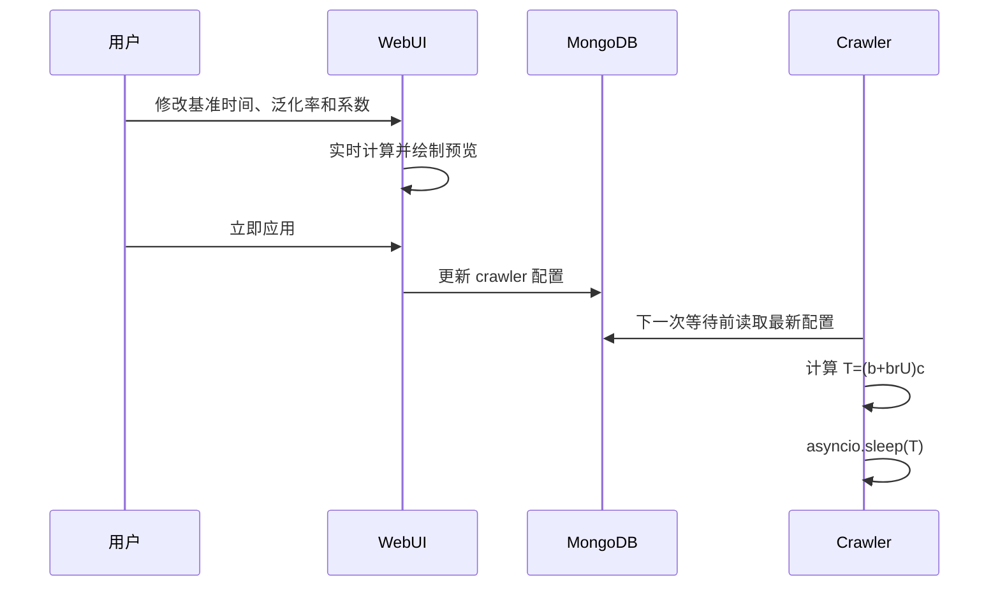

# 爬虫等待时间数学模型

## 1. 目标

爬虫在页面加载、滚动、打开帖子和关闭详情等操作之间主动等待，以便给页面留出加载时间，并避免所有操作都按照固定节奏执行。

这个模型需要同时满足：

- WebUI 可以统一调整整体等待速度；
- 不同调用点可以保留不同的快慢层次；
- 每次等待带有随机扰动；
- 修改配置后，运行中的爬虫从下一次等待开始使用新参数；
- WebUI 可以预览单次等待及多次等待平均值的大致概率分布。

## 2. 参数定义

每个爬虫在 MongoDB 配置文档中保存以下参数：

| 字段 | 记号 | 默认值 | 含义 |
| --- | --- | ---: | --- |
| `wait_base_seconds` | $b$ | $5$ | 基准时间，单位为秒 |
| `wait_random_rate` | $r$ | $0.6$ | 随机增量相对基准时间的最大比例 |
| `wait_initial_multiplier` | $c$ | $1.0$ | 首次加载系数 |
| `wait_scroll_multiplier` | $c$ | $0.8$ | 滚动加载系数 |
| `wait_post_multiplier` | $c$ | $0.4$ | 帖子交互系数 |
| `wait_detail_open_multiplier` | $c$ | $0.6$ | 打开详情系数 |
| `wait_detail_close_multiplier` | $c$ | $0.6$ | 关闭详情系数 |
| `wait_error_multiplier` | $c$ | $0.6$ | 异常恢复系数 |

WebUI 和 API 目前约束：

$$
0 \le b \le 300,\qquad 0 \le r \le 10,\qquad 0 \le c \le 10
$$

系数 $c=0$ 表示该调用点不主动等待。泛化率 $r=0$ 表示等待时间固定。

## 3. 单次等待

Python 的 `random.random()` 产生区间 $[0,1)$ 上的均匀随机数。令：

$$
U \sim \operatorname{Uniform}(0,1)
$$

单次等待时间 $T$ 为：

$$
T=(b+brU)c=bc+bcrU
$$

因此：

$$
T \sim \operatorname{Uniform}(bc,\ bc(1+r))
$$

单次等待的最短、最长和平均时间分别为：

$$
T_{\min}=bc
$$

$$
T_{\max}=bc(1+r)
$$

$$
\mathbb E[T]=bc\left(1+\frac r2\right)
$$

方差和标准差为：

$$
\operatorname{Var}(T)=\frac{(bcr)^2}{12}
$$

$$
\operatorname{SD}(T)=\frac{bcr}{\sqrt{12}}
$$

### 默认参数示例

当 $b=5$、$r=0.6$ 时，各调用点的单次等待范围如下：

| 调用点 | 系数 | 最短 | 平均 | 最长 |
| --- | ---: | ---: | ---: | ---: |
| 首次加载 | $1.0$ | $5$ 秒 | $6.5$ 秒 | $8$ 秒 |
| 滚动加载 | $0.8$ | $4$ 秒 | $5.2$ 秒 | $6.4$ 秒 |
| 帖子交互 | $0.4$ | $2$ 秒 | $2.6$ 秒 | $3.2$ 秒 |
| 打开详情 | $0.6$ | $3$ 秒 | $3.9$ 秒 | $4.8$ 秒 |
| 关闭详情 | $0.6$ | $3$ 秒 | $3.9$ 秒 | $4.8$ 秒 |
| 异常恢复 | $0.6$ | $3$ 秒 | $3.9$ 秒 | $4.8$ 秒 |

## 4. 同一调用点的平均等待

WebUI 的“平均取样次数”表示：选择一个调用点后，假设它以相同参数独立执行 $n$ 次。令每次等待为 $T_i$，累计等待时间为：

$$
S_n=\sum_{i=1}^{n}T_i
$$

假设每次 `random.random()` 的结果相互独立，则：

$$
S_n=nbc+bcr\sum_{i=1}^{n}U_i
$$

其中 $\sum U_i$ 服从 Irwin–Hall 分布。WebUI 不直接显示累计总时长，而是显示每次平均等待时间：

$$
\bar T_n=\frac{S_n}{n}=bc+\frac{bcr}{n}\sum_{i=1}^{n}U_i
$$

平均等待时间的范围与单次等待相同：

$$
\bar T_{n,\min}=bc
$$

$$
\bar T_{n,\max}=bc(1+r)
$$

$$
\mathbb E[\bar T_n]=bc\left(1+\frac r2\right)
$$

$$
\operatorname{Var}(\bar T_n)=\frac{(bcr)^2}{12n}
$$

$$
\operatorname{SD}(\bar T_n)=\frac{bcr}{\sqrt{12n}}
$$

取样次数不会改变平均等待的期望和可能范围，但标准差随 $1/\sqrt n$ 缩小。因此次数越多，平均值越集中在理论期望附近。

### 默认参数取样 10 次

以首次加载的默认参数 $b=5$、$r=0.6$、$c=1$ 为例：

$$
\bar T_{10,\min}=5\text{ 秒}
$$

$$
\mathbb E[\bar T_{10}]=6.5\text{ 秒}
$$

$$
\bar T_{10,\max}=8\text{ 秒}
$$

$$
\operatorname{SD}(\bar T_{10})=\frac{3}{\sqrt{120}}\approx0.274\text{ 秒}
$$

## 5. 分布曲线

### 5.1 一次等待

当 $n=1$ 时，等待时间在最短值和最长值之间等概率取值，因此 WebUI 显示矩形的均匀分布。

### 5.2 少量取样的平均值

当 $2 \le n < 12$ 时，WebUI 绘制缩放后的 Irwin–Hall 分布相对概率密度。两次均匀分布的平均值呈三角形；继续增加次数后，曲线会逐步变得平滑并集中在期望附近，同时横轴仍表示每次平均等待的秒数。

对标准 Irwin–Hall 随机变量 $X_n=\sum U_i$，概率密度为：

$$
f_{X_n}(x)=\frac{1}{(n-1)!}\sum_{k=0}^{\lfloor x\rfloor}(-1)^k\binom nk(x-k)^{n-1},\qquad 0\le x\le n
$$

WebUI 只需要绘制相对曲线，因此会按峰值归一化，不显示概率密度的绝对数值。

### 5.3 正态近似

当 $n$ 增大时，根据中心极限定理，平均等待近似服从：

$$
\bar T_n\ \xrightarrow{\mathrm{approx}}\ \mathcal N\left(
bc\left(1+\frac r2\right),
\frac{(bcr)^2}{12n}
\right)
$$

当前 WebUI 从 $n\ge12$ 开始绘制正态近似曲线。`12` 是展示层使用的固定阈值，不是数学上的突变点；实际分布会随着 $n$ 增加连续地接近正态分布。

## 6. 为什么不是伯努利或泊松分布

伯努利试验每次只有“成功”和“失败”两个离散结果。当前等待模型每次从连续区间中取值，因此单次试验是连续均匀分布，不是伯努利分布。

泊松分布通常描述固定时间或空间范围内独立事件的发生次数。当前模型研究的是多次随机等待的时间总和，不是事件计数，因此也不服从泊松分布。

平均等待接近正态分布的原因是中心极限定理：多个独立、同分布且方差有限的连续随机变量取平均后，其标准化结果趋近正态分布。

## 7. 不同调用点混合时的模型

WebUI 当前预览的是同一个调用点重复 $n$ 次。如果要计算一次完整爬取流程，而流程中包含不同系数 $c_i$，总等待时间为：

$$
W=\sum_{i=1}^{m}(bc_i+b rc_iU_i)
$$

其均值和方差可以直接相加：

$$
\mathbb E[W]=b\left(1+\frac r2\right)\sum_{i=1}^{m}c_i
$$

$$
\operatorname{Var}(W)=\frac{(br)^2}{12}\sum_{i=1}^{m}c_i^2
$$

当调用点数量较多，且没有单个调用点占据绝大部分方差时，总等待时间同样可以用正态分布近似。由于爬取过程可能跳过重复帖子、进入异常恢复或提前结束，WebUI 暂不对完整流程的调用次数作假设。

## 8. 实现和边界

- 爬虫每次等待前从 MongoDB 读取最新参数，因此运行中修改会从下一次等待开始生效。
- 已经进入 `asyncio.sleep()` 的等待不会被中途缩短或延长。
- WebUI 的平均取样次数只控制图表预览，不会改变爬虫执行次数。
- 图表只统计主动等待，不包含页面网络加载、Playwright 操作、截图、MongoDB 或 Redis 请求耗时。
- 模型假设每次伪随机取值相互独立。它描述代码设定的等待分布，不保证网站观测到的完整操作间隔严格服从同一分布。
- 配置值为零是合法的。$b=0$、$c=0$ 或 $r=0$ 时，随机区间会退化为固定值。

## 9. 配置流程

